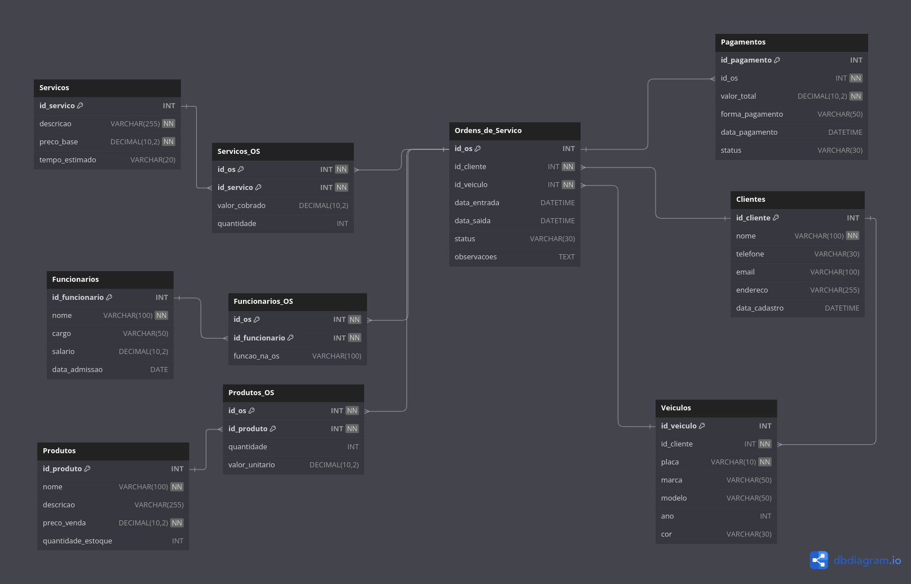

# 🚀 Projeto Final - 2º Semestre (IA & Banco de Dados)

[](https://www.docker.com/)
[](https://www.python.org/)
[](https://github.com/AngeloDev-New/Projeto-final)

Projeto de integração entre **Inteligência Artificial** e **Banco de Dados**, desenvolvido no 2º semestre do curso de IA. Utiliza Docker para infraestrutura e Python para manipulação de dados e automações.

---


## 🧰 Requisitos

- Docker + Docker Compose
- Python 3.x
- Git

---

## ⚙️ Como iniciar o projeto

### 🔁 Clone o repositório

```bash
git clone git@github.com:AngeloDev-New/Projeto-final.git
cd Projeto-final
```

### 🐳 Inicie os containers com Docker Compose

```bash
docker compose up
```

> Isso irá levantar os serviços definidos (como banco de dados, API etc).

---

## 🐍 Ambiente Virtual (Python)

### 📌 Linux / WSL

```bash
python -m venv venv
sudo chmod +x venv/bin/activate
. venv/bin/activate
```

### 📌 Windows (CMD ou PowerShell)

```cmd
python -m venv venv
venv\Scripts\activate
```

---

## 📦 Alimentar o banco de dados

Execute o script para popular o banco com os dados iniciais:

```bash
python app/script.py
```

---

## 📁 Estrutura do Projeto (resumo)

```
Projeto-final/
├── app/
│   └── script.py         # Script que alimenta o banco
├── docker-compose.yml    # Configuração dos containers
├── venv/                 # Ambiente virtual (não incluído no Git)
└── README.md             # Este arquivo
```

---

## 📌 Observações

- Certifique-se de que o Docker está em execução antes de usar `docker compose up`.
- O script `app/script.py` realiza a alimentação inicial do banco. Ele pode ser adaptado conforme a necessidade dos dados.
- Acessar bd: mysql -h 127.0.0.1 -P 4600 -u user -p mecanica
- Verificar tamanho:
SELECT 
  table_schema AS "Banco de Dados",
  ROUND(SUM(data_length + index_length) / 1024 / 1024, 2) AS "Tamanho (MB)"
FROM 
  information_schema.tables
WHERE 
  table_schema = "mecanica"
GROUP BY 
  table_schema;


---

## 📫 Contato

Desenvolvido por **AngeloDev-New**  
GitHub: [github.com/AngeloDev-New](https://github.com/AngeloDev-New)